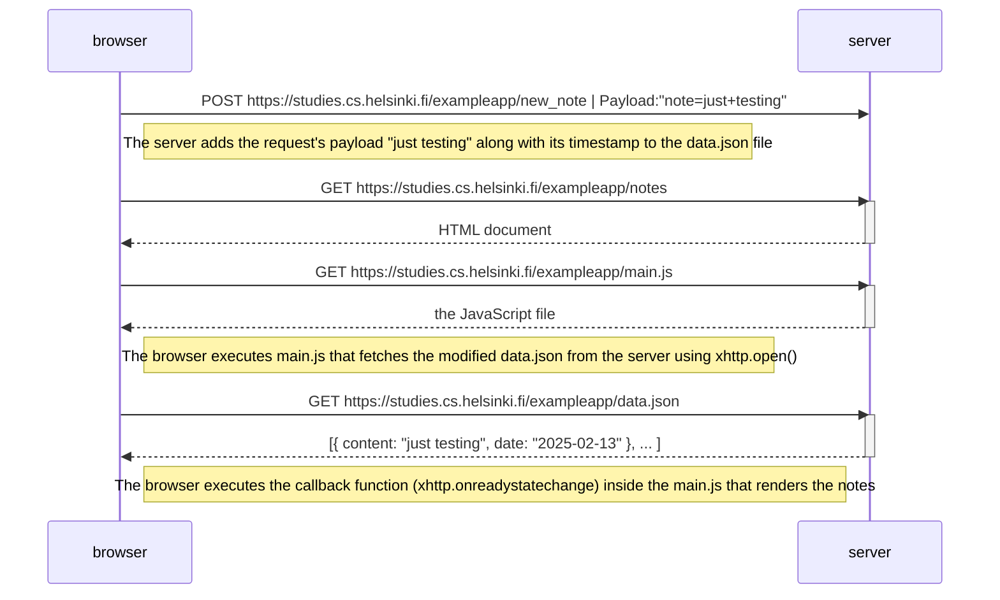

```mermaid
sequenceDiagram
    participant browser
    participant server

    browser->>server: POST https://studies.cs.helsinki.fi/exampleapp/new_note | Payload:"note=just+testing"

    Note right of browser: The server adds the request's payload "just testing" along with its timestamp to the data.json file

    browser->>server: GET https://studies.cs.helsinki.fi/exampleapp/notes
    activate server
    server-->>browser: HTML document
    deactivate server

    browser->>server: GET https://studies.cs.helsinki.fi/exampleapp/main.js
    activate server
    server-->>browser: the JavaScript file
    deactivate server

    Note right of browser: The browser executes main.js that fetches the modified data.json from the server using xhttp.open()

    browser->>server: GET https://studies.cs.helsinki.fi/exampleapp/data.json
    activate server
    server-->>browser: [{ content: "just testing", date: "2025-02-13" }, ... ]
    deactivate server

    Note right of browser: The browser executes the callback function (xhttp.onreadystatechange) inside the main.js that renders the notes
```
