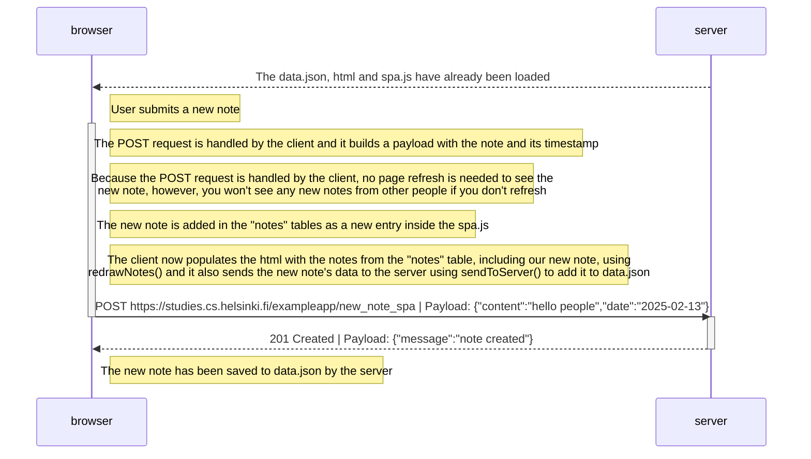

```mermaid
sequenceDiagram
    participant browser
    participant server

    server-->>browser: The data.json, html and spa.js have already been loaded

    Note right of browser: User submits a new note
    activate browser
    Note right of browser: The POST request is handled by the client and it builds a payload with the note and its timestamp
    Note right of browser: Because the POST request is handled by the client, no page refresh is needed to see the<br> new note, however, you won't see any new notes from other people if you don't refresh
    Note right of browser: The new note is added in the "notes" tables as a new entry inside the spa.js
    Note right of browser: The client now populates the html with the notes from the "notes" table, including our new note, using<br> redrawNotes() and it also sends the new note's data to the server using sendToServer() to add it to data.json

    browser->>server: POST https://studies.cs.helsinki.fi/exampleapp/new_note_spa | Payload: {"content":"hello people","date":"2025-02-13"}
    deactivate browser
    activate server
    server-->>browser: 201 Created | Payload: {"message":"note created"}
    deactivate server

    Note right of browser: The new note has been saved to data.json by the server
```
